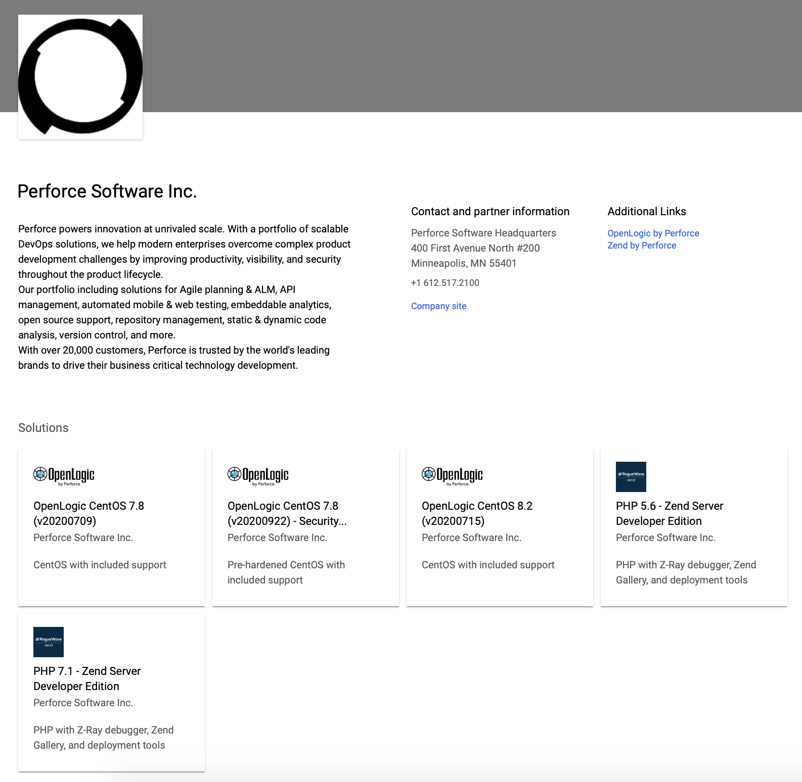
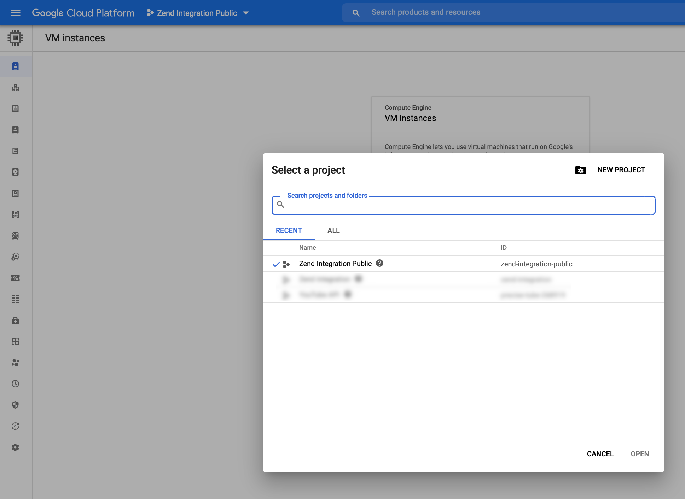

# Getting Started with OpenLogic CentOS images within Google Cloud

## Deploying

Using your web broswer, go to https://console.cloud.google.com/marketplace/partners/zend-integration-public and select the CentOS solution that you wish to deploy.

Once you have selected the appropriate CentOS version, click `Launch`

You can take the default settings or customize them.  

Check the `I accept the GCP Marketplace Terms of Service` box.

When complete click `Deploy`

That's it!  Your VM instance is now being created.

## Logging into the VM

To view your instances, go to https://console.cloud.google.com/compute/instances

If you cannot see the VM instance that you just launched, make sure you have selected the correct project within your account.

When you have located the VM instance you wish to log into, make sure it has a green checkmark and click on the VM name.

Under `Details`, there is a `Remote Access` section at the top.  You will see a `SSH` button there.  Clicking that button will transfer the ssh keys to the VM and log you into the VM via a new browser window.  

There is also a drop-down to the right of the SSH button which has other options for accessing the instance.

If you wish to ssh into the instance from another ssh client, scroll down to the bottom of the VM instance details page and locate the `SSH Keys` section.  This section lists the username(s) and the public portion of the ssh key(s) that are able to log into the instance. 

## Support

Included with our GCE images is 9x5 email-only support from our team of Tier 4 architects and engineers.  

Please send support requests to support@openlogic.com including your name, email, CentOS solution name and Cloud Account ID that is running this image.

Silver (12x5) and Gold (24x7) support options are also available. 

## Next Steps

If you want to learn more about OpenLogic by Perforce, our Open Source Software support, including CentOS support, visit us at http://www.openlogic.com , email us at info@roguewave.com or call us at +1 800.487.3217
